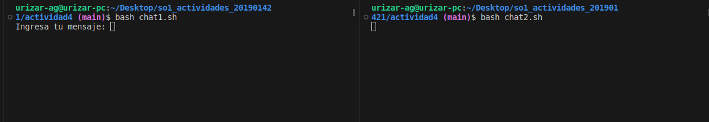
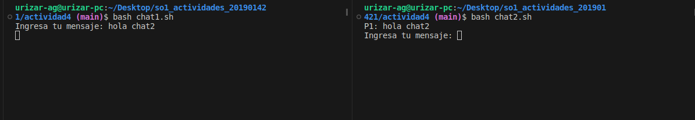
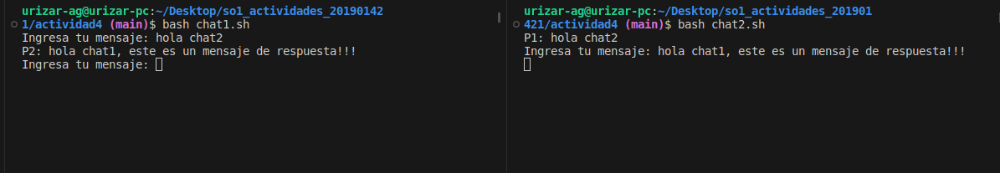
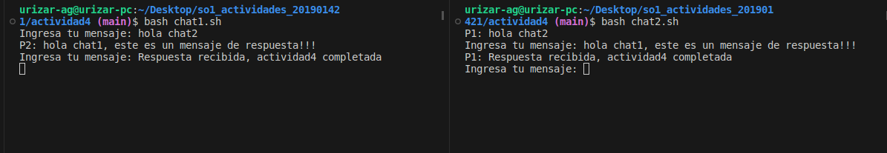
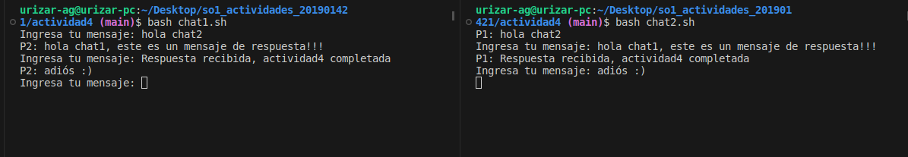

#### UNIVERSIDAD DE SAN CARLOS DE GUATEMALA  
#### FACULTAD DE INGENIERÍA  
#### ESCUELA DE CIENCIAS Y SISTEMAS  
#### SISTEMAS OPERATIVOS 1  
#### SECCIÓN "A"  
---    
#### ACTIVIDAD 4
#### ANGEL MIGUEL GARCÍA URIZAR
#### 201901421
---  
### **Paso 1**  
* Otorgar permiso de ejecución al archivo `chat1.sh` con el siguiente comando:  
  ```bash  
    sudo chmod +x chat1.sh
  ```  
* Otorgar permiso de ejecución al archivo `chat2.sh` con el siguiente comando:  
  ```bash  
    sudo chmod +x chat2.sh
  ```  
  
### **Paso 2**  
Iniciar el chat:  

* Abrir la terminal y poner en ejecución el primer script con el siguiente comando:  
  ```bash  
    bash chat1.sh
  ```  
* Abrir una nueva ventana o pestaña de terminal y poner ejecución el segundo script de bash, utilizar el siguiente comando:  
  ```bash  
    bash chat2.sh
  ``` 
**Nota:** Para el funcionamiento correcto del chat es importante que sea el chat1 quien inicie la conversación, es decir, que es `chat1.sh` quien debe ejecutarse primero.  
  
### **Paso 3**  
Dentro del chat es el chat1 quien debe mandar el primer mensaje, al ser enviado automaticamente el chat2 podra verlo. Para poder enviar otro mensaje es necesario recibir respuesta por lo que chat1 debe esperar la respuesta de chat2 para poder escribir otro mensaje y enviar otro. Esto mismo sucede para chat2, debe de esperar la respuesta de chat1 para poder escribir y enviar otro mensaje.  

Para finalizar el chat y la ejecución del script presionar la siguiente combinación en el teclado (en ambas ventanas o pestañas de la terminal), `Ctrl + c`  

---    

* Inicio del chat  
    

* Mensaje de chat1  
     

* Respuesta de chat2  
    

* Respuesta de chat1
    

* Despedida  
  
