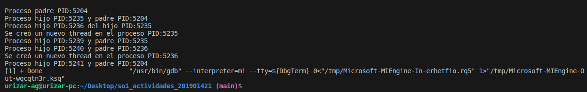

### UNIVERSIDAD DE SAN CARLOS DE GUATEMALA  
### FACULTAD DE INGENIERÍA  
### ESCUELA DE CIENCIAS Y SISTEMAS  
### SISTEMAS OPERATIVOS 1  
### SECCIÓN "A"  
---    
### ACTIVIDAD 5
### ANGEL MIGUEL GARCÍA URIZAR
### 201901421
---  

#### Resultado de la ejecución  

  

```
1.¿Cuántos procesos únicos son creados?  
  
R//Se crean 6 procesos en total. El proceso padre original, 2 procesos son creados por el proceso padre original, 2 procesos son creados por el primer hijo del padre original y 1 proceso por el hijo del primer hijo del padre original.    
```   
  
```
2. ¿Cuántos hilos únicos son creados?  
   
R//Se crean 2 hilos. El primero es creado por el primer proceso hijo del padre original y el segundo thread es creado por el hijo del primer hijo del padre original.  
```  
